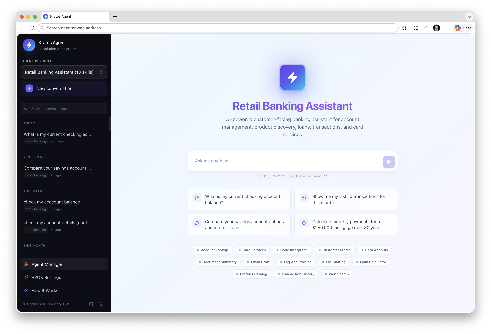
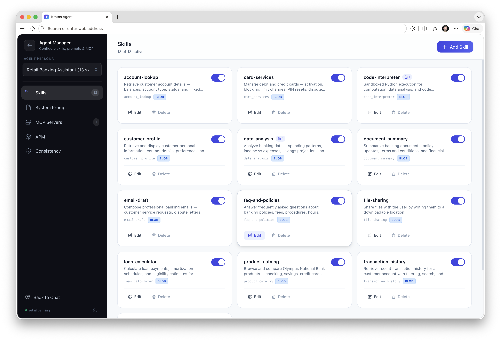
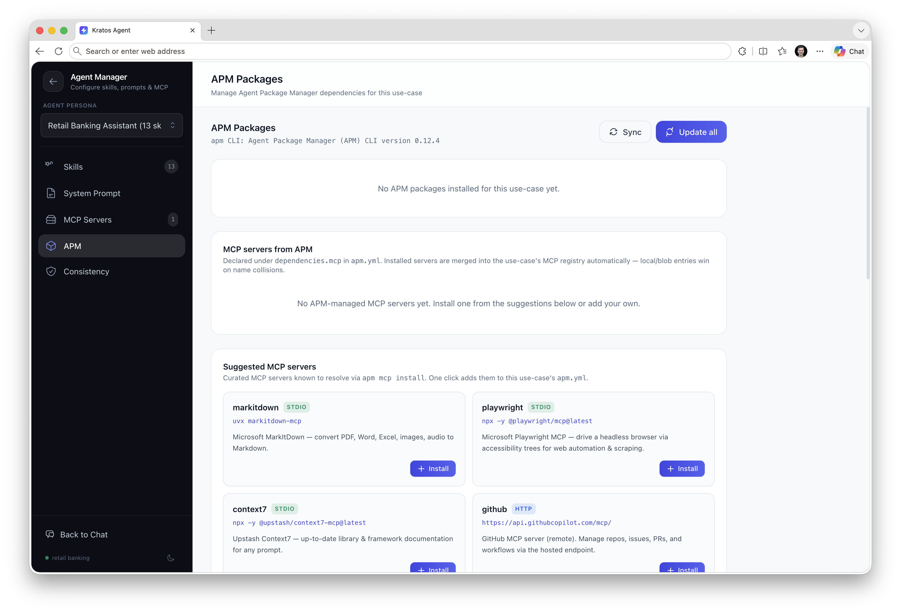
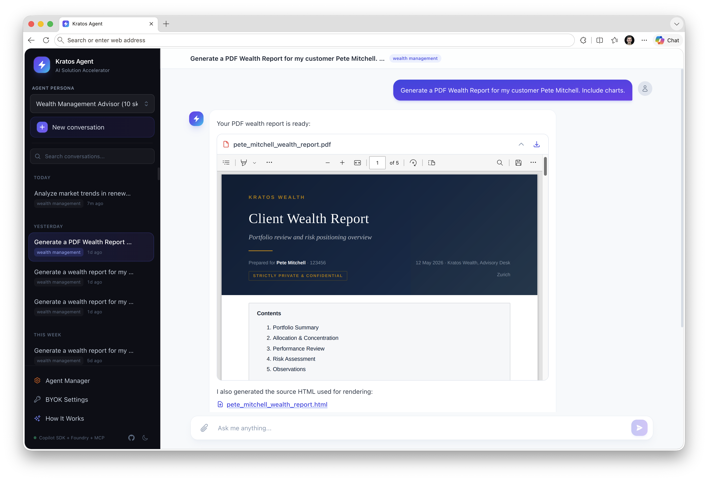

<div align="center">

# Kratos Agent

**Production-ready reference architecture for building extensible AI agents on Azure**

[](https://portal.azure.com)
[](https://github.com/features/copilot)
[](https://ai.azure.com)
[](https://modelcontextprotocol.io)
[](https://python.org)
[](https://nextjs.org)
[](LICENSE)

One-command deploy (`azd up`) provisions 15+ Azure services, builds containers, deploys a hosted agent to Microsoft Foundry, and serves a production frontend — all wired with Managed Identity, VNet isolation, and OpenTelemetry tracing.

</div>

---

## Screenshots

<div align="center">

### Chat Interface
Conversational UI with persona switching, suggested prompts, and live skill indicators.



### Agent Manager — Skills
Configure, toggle, and manage MCP skills per agent persona — no redeploy needed.



### Agent Manager — APM Packages
Install remote skill packages and MCP servers from the curated registry with one click.



### PDF Wealth Report Generation *(example)*
One example of what the agent can produce: the wealth management persona generates branded, multi-page PDF reports with charts — rendered via Playwright and served as downloadable files.



</div>

---

## Architecture

### Why This Architecture — One Agent, N Skills

Instead of orchestrating handoffs between multiple specialized agents, Kratos uses a single agent backed by N swappable MCP skills — simpler to reason about, debug, and extend.

<div align="center">

</div>

### Agentic Loop — Reason, Act, Observe

Each turn follows a Reason → Act → Observe cycle powered by the Copilot SDK. The agent plans its approach, invokes tools, inspects results, and iterates until it has a complete answer.

<div align="center">

</div>

### System Overview

End-to-end request flow from the frontend through the AI Gateway to the Foundry-hosted agent, which calls models and executes skills against platform services.

<div align="center">

</div>

### Dual-Compute Architecture

Kratos runs two compute layers that work together:

| Layer | Runtime | Purpose |
|-------|---------|---------|
| **Hosted Agent** | Microsoft Foundry (auto-scaled, Invocations protocol, port 8088) | Runs the Copilot SDK agentic loop, executes skills, calls models |
| **Backend Proxy** | Azure Container Apps (FastAPI, port 8000) | Frontend API, conversation persistence, file serving, admin endpoints |

The backend proxies all chat requests to the Foundry hosted agent via the Invocations REST API and streams SSE events back to the frontend. Gateway session pinning (`x-agent-session-id` header) ensures multi-turn conversations route to the same agent container, preserving in-memory SDK state.

### Core Pillars

| Pillar | Technology | Role |
|--------|------------|------|
| **Engine** | [GitHub Copilot SDK](https://github.com/features/copilot) `0.1.32` | Agentic loop — Plan → Act → Observe → Iterate |
| **Platform** | [Microsoft Foundry](https://ai.azure.com) | Hosted agent lifecycle, model hosting, evaluation, guardrails |
| **Extensibility** | [MCP Skills Protocol](https://modelcontextprotocol.io) | Portable, standard tool interface for agent capabilities |
| **Persistence** | [Azure Cosmos DB](https://learn.microsoft.com/azure/cosmos-db/) | Conversations, messages, settings, session mappings |
| **Observability** | [OpenTelemetry](https://opentelemetry.io) + Foundry Traces | End-to-end tracing with GenAI semantic conventions |

---

## Tech Stack

### Backend

| Component | Technology | Version |
|-----------|-----------|---------|
| Language | Python | 3.11 |
| Web framework | FastAPI + uvicorn | ≥0.115 |
| Agent SDK | `github-copilot-sdk` | 0.1.32 |
| Agent runtime | Copilot CLI (`@github/copilot`) | latest |
| Hosted agent protocol | `azure-ai-agentserver-invocations` | ≥1.0.0b3 |
| Database | Azure Cosmos DB (serverless) / SQLite (local) | — |
| Blob storage | Azure Storage / Azurite (local) | — |
| Search | Azure AI Search | — |
| PDF rendering | Playwright Chromium | — |
| Telemetry | OpenTelemetry + Azure Monitor Exporter | — |
| Package manager | APM CLI (`apm-cli`) | ≥0.5.0 |

### Frontend

| Component | Technology | Version |
|-----------|-----------|---------|
| Framework | Next.js (static export) | 14 |
| UI | React + Tailwind CSS | 18 / 3.4 |
| Auth | MSAL (Azure AD) | 3.20 |
| Markdown | react-markdown + remark-gfm | 9.0 |
| Hosting | Azure Static Web Apps | — |

### Infrastructure (Bicep)

15 Azure services provisioned via `azd up`:

> VNet · Container Apps Environment · Container App · Container Registry · Static Web App · API Management (AI Gateway) · AI Services · AI Search · Cosmos DB · Blob Storage · Key Vault · App Insights · Log Analytics · Bing Search · RBAC Role Assignments

---

## Quick Start

### Prerequisites

- [Azure Developer CLI (azd)](https://learn.microsoft.com/azure/developer/azure-developer-cli/) ≥1.12
- [Azure CLI](https://learn.microsoft.com/cli/azure/)
- [Docker](https://www.docker.com/)
- [Node.js 20+](https://nodejs.org/)
- [Python 3.11+](https://www.python.org/)

### Deploy to Azure

```bash
git clone https://github.com/kmavrodis/kratos-agent && cd kratos-agent
azd up
```

This single command:
1. Provisions all Azure infrastructure via Bicep (VNet, Cosmos DB, AI Gateway, etc.)
2. Builds Docker images for the backend and hosted agent
3. Pushes images to Azure Container Registry
4. Deploys the backend to Container Apps
5. Deploys the hosted agent to Microsoft Foundry (via `azd ai agent` extension)
6. Exports the frontend as a static site and deploys to Static Web Apps
7. Configures all Managed Identity role assignments
8. Outputs the public URL

### Register the Agent in Foundry (One-Time Manual Step)

After `azd up`, register the agent in the Foundry portal so traces appear in the Operate tab:

1. Open [Microsoft Foundry](https://ai.azure.com) → your project → **Operate** → **Agents**
2. Click **+ Register agent** (Custom Agent)
3. Set **Name** to `kratos-agent`, select the provisioned APIM gateway, enter the Container App URL as backend, and `kratos-agent` as API path
4. Complete the wizard

> **Tip:** `azd env get-values | grep AGENT_SERVICE` shows the Container App URL and gateway URL.

This is the only manual step — it cannot be automated because the Foundry Control Plane creates internal metadata linking the APIM API to the tracing pipeline.

---

## Local Development

### Full Local Mode (No Azure Required)

Run the entire stack on your laptop with zero Azure dependencies. A GitHub Copilot token replaces Foundry models, SQLite replaces Cosmos DB, and Azurite replaces Blob Storage.

```bash
cp .env.local.example .env.local
# Set COPILOT_GITHUB_TOKEN=ghu_xxx (from github.com/settings/tokens, Copilot scope)
./run-local.sh          # or .\run-local.ps1 on Windows
```

| Service | URL | Notes |
|---------|-----|-------|
| Backend | `http://localhost:8000` | FastAPI + Copilot SDK |
| Azurite | `http://localhost:10000` | Local blob emulator |
| Frontend | `http://localhost:3000` | `cd src/frontend && npm install && npm run dev` |

**Auto-detection:** `LOCAL_MODE` activates whenever `COSMOS_DB_ENDPOINT` is empty. The same codebase runs in both environments without code changes.

**Persistent data:**
- `.local/backend/kratos.db` — SQLite (conversations, messages, settings, sessions)
- `.local/azurite/` — Emulated blob storage (skills, APM manifests)
- `use-cases/` — Bind-mounted; edits on host appear immediately

### Development Against Azure

```bash
# Backend (connects to Azure services via env vars)
cd src/backend
pip install -e ".[dev]"
uvicorn app.main:app --reload --port 8000

# Frontend
cd src/frontend
npm install && npm run dev
```

---

## How It Works

### Request Flow

```
1. User sends message via frontend
2. POST /api/agent/chat → Backend (FastAPI)
3. Backend looks up gateway session ID for the conversation
4. Backend forwards to Foundry hosted agent via Invocations REST API
5. Hosted agent runs CopilotClient agentic loop:
   a. Load system prompt + use-case skills
   b. Call model (GPT-4o / GPT-5) with tools
   c. Execute tool calls (MCP skills, code interpreter, RAG, etc.)
   d. Iterate until the model produces a final response
6. Hosted agent streams SSE events back through the proxy
7. Backend persists messages to Cosmos DB
8. Frontend renders streaming response with live execution details
```

### Event Streaming (SSE)

The agent streams structured events to the frontend in real-time:

| Event | Purpose |
|-------|---------|
| `thought` | Agent reasoning and planning steps |
| `tool_call` | Skill invocations (started → completed/failed) |
| `content` | Response text chunks |
| `usage` | Token consumption (prompt, completion, reasoning) |
| `done` | Completion signal with execution metrics |
| `error` | Error details |

### Session Pinning

Multi-turn conversations require routing to the same hosted agent container to preserve in-memory SDK state:

1. First invocation → Foundry returns `x-agent-session-id` response header
2. Backend stores the mapping in Cosmos DB (`sessions` container, partitioned by `conversationId`)
3. Subsequent messages → Backend appends `?agent_session_id=<id>` to the Invocations URL
4. Foundry routes to the same container instance

### Copilot SDK Integration

The `CopilotAgent` class wraps the GitHub Copilot SDK:

```python
from copilot import CopilotClient
from copilot.tools import define_tool

# Agent manages sessions per conversation
client = CopilotClient(...)
async for event in client.run(message=msg, session_id=conv_id):
    # Translate SDK events → SSE events (content, thoughts, tool_calls, usage)
```

- **Auth:** `ChainedTokenCredential` (ManagedIdentity → AzureCLI) with `get_bearer_token_provider` for keyless model access
- **Multi-use-case:** Each use case gets its own `SkillRegistry` and system prompt; selected per conversation
- **Session resume:** SDK sessions are keyed by `conversation_id`; gateway session pinning ensures the same container handles all turns

---

## Use Cases

Kratos ships with four configurable agent personas, each with its own system prompt, skills, and APM manifest:

| Use Case | Directory | Description |
|----------|-----------|-------------|
| **Generic** | `use-cases/generic/` | General-purpose assistant with web search, code interpreter, file sharing |
| **Retail Banking** | `use-cases/retail-banking/` | Account lookup, transaction history, mortgage calculator, spending analysis |
| **Wealth Management** | `use-cases/wealth-management/` | Portfolio review, tax analysis, PDF wealth reports with charts |
| **Insurance** | `use-cases/insurance/` | Policy information, claims processing, coverage analysis |
| **Sales Account Review** | `use-cases/sales-account-review/` | AE/CSM co-pilot — account briefings, pipeline review, at-risk signals against the in-repo `salesforce-mcp-server` mock |

Each use case has:
- `SYSTEM_PROMPT.md` — Agent persona and behavior instructions
- `skills/` — Domain-specific MCP skills (SKILL.md files)
- `apm.yml` + `apm.lock.yaml` — Remote skill dependencies

Switch use cases per conversation via the frontend dropdown or `useCase` field in the API request.

---

## Skills & MCP Protocol

Skills extend the agent's capabilities using the [Model Context Protocol](https://modelcontextprotocol.io). Each skill is a directory with a `SKILL.md` file containing YAML frontmatter and natural-language instructions.

### Skill Format

```yaml
---
name: account-lookup
description: Retrieves customer account information
enabled: true
---

## Instructions
When the user asks about their account balance or account details...

## Supported Parameters
- account_id: The customer's account identifier

## Example
User: "What's my account balance?"
→ Call account_lookup with the user's account ID
```

### Skill Loading Architecture

Skills load from three sources in priority order:

1. **Blob Storage** (primary) — `use-cases/{use-case}/skills/{name}/SKILL.md`
2. **Local filesystem** (fallback) — Same path, read directly from disk
3. **APM packages** (supplementary) — Materialised into `.github/skills/` by `apm install`

Local/blob skills always win on name conflict with APM packages.

### Adding a Custom Skill

1. Create `use-cases/{use-case}/skills/my-skill/SKILL.md`
2. Upload to blob storage via the admin API: `POST /api/admin/skills/{use-case}/my-skill`
3. The skill is available immediately — no redeploy needed

### MCP Servers

External MCP servers (e.g., `faker-mcp-server`) are configured per use case via `use-cases/{use-case}/.mcp.json` and managed through the admin API at `/api/admin/mcp-servers/{use-case}`.

---

## APM — Agent Package Manager

[APM](https://microsoft.github.io/apm/) is a dependency manager for agent primitives — skills, prompts, MCP servers, and plugins. Think `package.json` for agents.

Each use case has a manifest at `use-cases/{name}/apm.yml`:

```yaml
name: kratos-generic
version: 1.0.0
target: copilot
dependencies:
  apm:
    - microsoft/apm-sample-package#v1.0.0
    - anthropics/skills/skills/frontend-design
  mcp: []
```

### Runtime Management

```bash
# Install a remote plugin (no redeploy needed)
curl -X POST https://<agent>/api/admin/use-cases/generic/apm/install \
  -H "Content-Type: application/json" \
  -d '{"package": "anthropics/skills/skills/frontend-design"}'

# Sync all dependencies from manifest
curl -X POST https://<agent>/api/admin/use-cases/generic/apm/sync
```

| Method | Endpoint | Purpose |
|--------|----------|---------|
| `GET` | `/api/admin/use-cases/{uc}/apm` | List dependencies + lockfile |
| `POST` | `/api/admin/use-cases/{uc}/apm/install` | Install a package |
| `DELETE` | `/api/admin/use-cases/{uc}/apm/{package}` | Uninstall a package |
| `POST` | `/api/admin/use-cases/{uc}/apm/sync` | Full resync from manifest |
| `POST` | `/api/admin/use-cases/{uc}/apm/update` | Update lockfile to latest refs |

### Security

`apm install` runs a content audit (hidden Unicode detection, known-bad package hashes) before materialising files. Diagnostics are surfaced in the admin API response.

---

## File Sharing

The agent can create files (CSVs, PDFs, charts, code) and share them with users via download links.

### How It Works

1. **Skill instructions** guide the agent to write files to `/tmp` and reference the path in the response
2. **Hosted agent** detects `/tmp/` file paths in the response, reads the files, and streams them as base64-encoded `file_content` SSE events
3. **Backend proxy** intercepts these events, decodes the base64 content, and saves files to its own `/tmp`
4. **Frontend** detects `/tmp/` paths in markdown and rewrites them as download links pointing to `GET /api/files/download/{filename}?path=/tmp/{filename}`

This SSE streaming approach solves the cross-container file sharing problem — the hosted agent (Foundry-managed, outside VNet) cannot directly access the storage account (private endpoint only), so files are streamed through the existing SSE channel instead.

---

## Observability

### OpenTelemetry

Full-stack instrumentation following [GenAI semantic conventions](https://opentelemetry.io/docs/specs/semconv/gen-ai/):

| Layer | Instrumentation |
|-------|----------------|
| HTTP | `FastAPIInstrumentor` — request/response tracing |
| Models | `OpenAIInstrumentor` (openai-v2) — LLM call tracing |
| Agent | Custom spans for `invoke_agent`, `execute_tool` |
| Logs | Python logging bridge → OTel Logs → App Insights |

**Exporters:** `AzureMonitorTraceExporter`, `AzureMonitorMetricExporter`, `AzureMonitorLogExporter`

**Custom metrics:**
- `gen_ai.client.token.usage` — histogram for input/output token counts
- `gen_ai.client.operation.duration` — histogram for operation latency

### Foundry Traces

All frontend traffic routes through the **AI Gateway (APIM)**, configured with an Application Insights logger at 100% sampling. The Foundry Traces tab reads from App Insights to display end-to-end agent execution traces including:

- User messages and agent responses
- Tool/skill invocations with inputs and outputs
- Token consumption per model call
- Latency breakdown (time-to-first-token, model latency, total duration)

### Frontend Execution Details

The UI shows real-time execution details per message:

- **Tool pills** — Live status (started → completed/failed) during streaming
- **Metrics grid** — Total time, first token latency, model latency, tool call count
- **Token usage bar** — Prompt / reasoning / output breakdown
- **Execution flow timeline** — Thoughts connected with arrows
- **Tool I/O** — Expandable input/output for each completed tool call

---

## Evals & Tracing

Per-use-case evaluation harness and an App-Insights waterfall trace inspector — both surfaced as admin tabs in the UI and exposed via CLI for CI.

### Per-Use-Case Eval Scenarios

Each use-case carries its own eval suite under `use-cases/<name>/evals/`:

```
use-cases/insurance/evals/
  eval_config.json          ← evaluator list + judge model
  scenarios/                ← committed JSON scenarios
    load-customer-profile.json
    policy-wording-lookup.json
    ...
  results/                  ← run output (gitignored)
```

Each scenario declares an `input_message`, `expected_behavior`, `expected_tool_calls`, and the Foundry evaluator set to apply (e.g. `Relevance`, `Coherence`, `TaskAdherence`, `IntentResolution`, `ToolCallAccuracy`).

### Two Eval Modes

| Mode | Pattern | Speed | Use |
|------|---------|-------|-----|
| **validation** | In-process: invoke agent sequentially → score locally with `azure-ai-evaluation` evaluators | Seconds | Fast feedback loop, CI smoke |
| **foundry** | Full Foundry eval pipeline (same evaluators, hosted scoring) | Minutes | Pre-release runs, shareable Foundry portal links |

Both modes follow the **two-phase invoke + score** pattern from the `foundry-evals` awesome-gbb skill: Phase 1 invokes the hosted agent via `AIProjectClient(...).get_openai_client(agent_name=...)` with a warmup retry loop for cold starts; Phase 2 scores the recorded turns with the evaluators configured in `eval_config.json`.

### LLM-Generated Scenarios

The "Generate Scenarios" modal (or `POST /api/use-cases/{uc}/evals/scenarios/generate`) reads the use-case `SYSTEM_PROMPT.md` and the loaded skill catalog and asks the judge model to draft realistic conversations that exercise the agent. Each draft is hand-reviewable before commit. Industry-realism canons from `threadlight-demo-data-factory` are injected for FSI-shaped use-cases (`insurance`, `retail-banking`, `wealth-management`) so generated data feels plausible.

### Traces Panel

The "Traces" admin tab queries App Insights via `LogsQueryClient` (resource-scoped) and renders a per-operation waterfall classified into `llm / agent / tool / skill / http / platform / error` spans. Filterable by `use_case`, `conversation_id`, `run_id`, and lookback window. Identical UX to `threadlight-vnext`.

Spans carry three custom attributes for the filter:

- `kratos.use_case`
- `kratos.conversation_id`
- `kratos.eval_run_id` (only set during eval runs)

These are stamped in `copilot_agent.py` and forwarded to the hosted agent via `x-kratos-*` headers from `foundry_agent_proxy.py`.

### CLI

For CI / scripting:

```bash
# Generate (and optionally save) scenarios
BACKEND_URL=https://kratos-be.example.com \
  python scripts/generate_evals.py --use-case insurance --count 5 --save

# Run validation evals
python scripts/run_evals.py --use-case insurance --mode validation

# Run hosted Foundry evals
python scripts/run_evals.py --use-case insurance --mode foundry

# Inspect traces
python scripts/fetch_traces.py --conversation-id abc123
```

---

## Security

| Control | Implementation |
|---------|---------------|
| **Zero secrets in code** | All secrets in Key Vault, accessed via Managed Identity |
| **Passwordless auth** | `ChainedTokenCredential` (ManagedIdentity → AzureCLI) for all service-to-service |
| **Network isolation** | VNet with private endpoints for Cosmos DB, Key Vault, Blob Storage, AI Search |
| **Identity** | Least-privilege RBAC role assignments per service identity |
| **Content safety** | Foundry guardrails (prompt shields, jailbreak detection) |
| **File serving** | Path traversal protection, MIME type allowlisting, safe filename validation |
| **Frontend auth** | MSAL (Microsoft Entra ID) with `@azure/msal-react` |

---

## Project Structure

```
kratos-agent/
├── azure.yaml                      # azd config: 3 services (agent-service, hosted-agent, web)
├── docker-compose.yml              # Local dev: backend + azurite
│
├── infra/                          # Bicep IaC (15 modules)
│   ├── main.bicep
│   └── modules/
│       ├── network.bicep           # VNet + subnets + private endpoints
│       ├── agent-service.bicep     # Container App (backend proxy)
│       ├── ai-gateway.bicep        # APIM BasicV2 (AI Gateway + diagnostics)
│       ├── ai-services.bicep       # Azure AI Services (model hosting)
│       ├── ai-search.bicep         # Azure AI Search (RAG index)
│       ├── cosmos-db.bicep         # Cosmos DB serverless (4 containers)
│       ├── blob-storage.bicep      # Storage Account (skills, APM)
│       ├── container-apps-env.bicep
│       ├── container-registry.bicep
│       ├── static-web-app.bicep
│       ├── key-vault.bicep
│       ├── app-insights.bicep
│       ├── log-analytics.bicep
│       ├── bing-search.bicep
│       └── role-assignments.bicep  # All RBAC assignments
│
├── src/
│   ├── backend/                    # Python agent service (FastAPI)
│   │   ├── Dockerfile              # python:3.11-slim + Node.js 20 + Playwright
│   │   ├── pyproject.toml
│   │   └── app/
│   │       ├── main.py             # FastAPI entry point (port 8000)
│   │       ├── config.py           # Settings + LOCAL_MODE auto-detection
│   │       ├── models.py           # Pydantic event schemas
│   │       ├── observability.py    # OpenTelemetry setup
│   │       ├── routers/
│   │       │   ├── agent.py        # POST /api/agent/chat — SSE proxy to hosted agent
│   │       │   ├── conversations.py
│   │       │   ├── files.py        # GET /api/files/download/{filename}
│   │       │   ├── settings.py
│   │       │   ├── use_cases.py
│   │       │   ├── copilot_studio.py  # Copilot Studio / Teams bridge
│   │       │   ├── admin_skills.py
│   │       │   ├── admin_prompt.py
│   │       │   ├── admin_apm.py
│   │       │   ├── admin_mcp.py
│   │       │   └── admin_analysis.py  # Use-case consistency analysis
│   │       └── services/
│   │           ├── copilot_agent.py       # CopilotClient wrapper + agentic loop
│   │           ├── cosmos_service.py      # Cosmos DB / SQLite persistence
│   │           ├── skill_registry.py      # Per-use-case skill loading
│   │           ├── skill_tools.py         # @define_tool implementations
│   │           ├── blob_skill_service.py  # Blob CRUD for skills
│   │           ├── foundry_agent_proxy.py # Invocations REST API client
│   │           ├── apm_service.py         # APM CLI wrapper
│   │           ├── ai_search_tools.py     # AI Search index management
│   │           └── follow_up_service.py   # Follow-up question generation
│   │
│   ├── hosted-agent/               # Foundry hosted agent
│   │   ├── Dockerfile              # python:3.11-slim + same tooling as backend
│   │   ├── main.py                 # InvocationAgentServerHost (port 8088)
│   │   ├── agent.yaml              # Foundry agent manifest
│   │   └── pyproject.toml
│   │
│   └── frontend/                   # Next.js 14 chat UI
│       └── src/
│           ├── app/                # Pages
│           ├── components/         # ChatWindow, MessageBubble, ThoughtChain, etc.
│           ├── lib/                # API client, config
│           └── types/              # TypeScript types
│
├── use-cases/                      # Agent personas
│   ├── generic/                    # General-purpose assistant
│   ├── retail-banking/             # Banking agent
│   ├── wealth-management/          # Wealth advisor
│   └── insurance/                  # Insurance agent
│
└── hooks/
    └── postdeploy.sh               # Post-deployment configuration
```

---

## API Reference

### Agent

| Method | Endpoint | Description |
|--------|----------|-------------|
| `POST` | `/api/agent/chat` | Stream agent response (SSE) |
| `POST` | `/api/agent/user-input` | Respond to agent input requests |

### Conversations

| Method | Endpoint | Description |
|--------|----------|-------------|
| `GET` | `/api/conversations` | List conversations |
| `POST` | `/api/conversations` | Create conversation |
| `GET` | `/api/conversations/{id}` | Get conversation + messages |
| `PATCH` | `/api/conversations/{id}` | Update conversation |
| `DELETE` | `/api/conversations/{id}` | Delete conversation |

### Files

| Method | Endpoint | Description |
|--------|----------|-------------|
| `GET` | `/api/files/download/{filename}` | Download agent-created file |

### Admin

| Method | Endpoint | Description |
|--------|----------|-------------|
| `GET/POST/PUT/DELETE` | `/api/admin/skills/{use-case}/*` | Skill CRUD |
| `GET/PUT` | `/api/admin/system-prompt/{use-case}` | System prompt management |
| `GET/POST/DELETE` | `/api/admin/use-cases/{uc}/apm/*` | APM dependency management |
| `GET/PUT` | `/api/admin/mcp-servers/{use-case}` | MCP server configuration |
| `POST` | `/api/admin/analysis` | Use-case consistency analysis |

### Copilot Studio

| Method | Endpoint | Description |
|--------|----------|-------------|
| `POST` | `/api/copilot-studio/chat` | Synchronous endpoint for Teams/M365 |

### System

| Method | Endpoint | Description |
|--------|----------|-------------|
| `GET` | `/health` | Health check |
| `GET` | `/api/settings` | Service configuration status |
| `GET` | `/api/use-cases` | List available use cases |

---

## Infrastructure

### Cosmos DB Data Model

| Container | Partition Key | Purpose |
|-----------|--------------|---------|
| `conversations` | `/userId` | Conversation metadata |
| `messages` | `/conversationId` | Chat messages + tool call metadata |
| `settings` | `/category` | System prompt, configuration |
| `sessions` | `/conversationId` | Gateway session ID ↔ conversation mappings |

### Network Topology

```
VNet
├── container-apps-subnet      # Container Apps Environment
├── private-endpoints-subnet   # Private endpoints for:
│                                 - Cosmos DB
│                                 - Key Vault
│                                 - Blob Storage
│                                 - AI Search
└── apim-subnet                # API Management (AI Gateway)
```

### Identity & RBAC

All service-to-service auth uses Managed Identity with least-privilege roles:

| Identity | Role | Scope |
|----------|------|-------|
| Container App | Cosmos DB Data Contributor | Cosmos DB account |
| Container App | Storage Blob Data Contributor | Storage account |
| Container App | Key Vault Secrets User | Key Vault |
| Container App | Search Index Data Reader | AI Search |
| AI Services | Storage Blob Data Contributor | Storage account |
| Static Web App | — | Reads config.json injected at deploy |

---

## Cost Baseline

| Service | Monthly Estimate |
|---------|-----------------|
| Container Apps (consumption) | $0 – $50 |
| Static Web Apps (free tier) | $0 |
| API Management (BasicV2) | ~$175 |
| Cosmos DB (serverless) | $5 – $25 |
| AI Search (Basic) | ~$75 |
| Key Vault | ~$1 |
| Container Registry (Basic) | ~$5 |
| Application Insights | $5 – $20 |
| Foundry Models (per-token) | Variable |
| **Total baseline** | **~$265 – $350/month** |

> Model costs (GPT-4o, GPT-5) are usage-dependent and not included in the baseline.

---

## License

MIT
