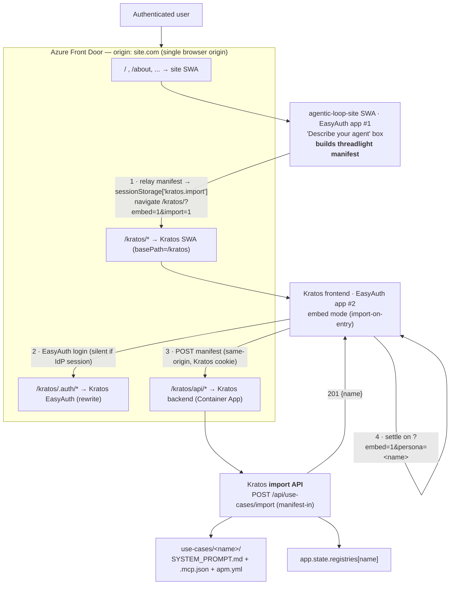

# Design Spec — Kratos Persona Import API + Embedded Hosting in agentic-loop-site

- **Date:** 2026-06-17
- **Status:** Design — locked direction (manifest-first + §10.1 Variant B), pre-implementation
- **Primary repo:** `kmavrodis/kratos-agent` (this worktree) — implemented here
- **Secondary repo:** `aiappsgbb/agentic-loop-site` — separate PR / separate session
- **Related skill (contract compatibility only):** `aiappsgbb/threadlight-skills → threadlight-design`

---

## 1. Problem & Goal

`agentic-loop-site` should let an (authenticated) user **describe an agent in natural
language** and get a **real, working Kratos persona** created for them — instead of
hand-authoring the three persona files. **The site turns the description into a
threadlight-compatible manifest; Kratos imports that manifest** to create the persona (the
site owns generation; Kratos owns import). The site should also **host the Kratos UI as if
it were part of the site** (same origin, same "included" feel), **without copying any
Kratos files**, so that deploying the site always uses the latest Kratos code (no
duplication, no drift).

Two deliverables (two PRs):

1. **Kratos PR (this repo, primary):** a persona **Import API** + the frontend changes
   that make Kratos **mountable under a sub-path** and **embeddable** ("included" mode).
2. **agentic-loop-site PR (secondary):** a **"Describe your agent" generate box** + the
   **embedded mount** of Kratos + the **Front Door route** that path-mounts Kratos under
   the site origin.

The persona **manifest the site builds must be compatible with `threadlight-design`** (its
`manifest.json` + `AGENTS.md` + skills shape) so the two ecosystems interoperate.

---

## 2. Locked-in Decisions (from clarification)

| # | Decision | Rationale |
|---|----------|-----------|
| D1 | **Two PRs**, Kratos primary (this worktree); site secondary (separate session — `~/Repos/agentic-loop-site` is a plain clone, not a worktree). | User directive. |
| D2 | **The site builds the manifest.** agentic-loop-site owns NL→manifest generation (its advisor / its own LLM / deterministic builder). Kratos does **not** generate personas from NL — it **imports a ready manifest**. | User directive: "agentic-loop-site creates the manifest and Kratos imports it." Site already has the contract/advisor concept (`advisor.ts`). |
| D3 | **Embedding = reverse-proxy / path-mount at deploy (Front Door)** under `site.com/kratos/*`. **Not** iframe, **not** module federation. | User picked §2; wants same-origin "included" feel + URL args; called federation "clumsy". |
| D4 | **No public/anonymous access.** Both the site SWA and Kratos SWA sit behind **Entra EasyAuth**. No demo mode, no ephemeral personas. | User directive. |
| D5 | **Different Entra app registrations** for site vs Kratos → entering `/kratos/*` triggers a **second EasyAuth round-trip** (silent if the browser already has an Entra IdP session; otherwise interactive). | User directive. Drives the basePath-aware `/.auth` work. |
| D6 | **Import endpoint is authenticated** (`require_authenticated_user`), consistent with all existing Kratos admin/export routes. | Security parity. |
| D7 | **Import-first, then redirect.** Sequence: site builds manifest → `POST /api/use-cases/import` (manifest-in) creates the persona → **only on success** the UX deep-links into the embedded Kratos at the new persona (`?embed=1&persona=<name>`). | User directive: "Kratos imports it first (new API) then UX redirects." |
| D8 | Import contract input is **the threadlight-`manifest.json`-compatible manifest** (structured, primary path). Optional NL `prompt` expansion in Kratos is a **secondary convenience**, off the main flow. | User NOTE about threadlight compatibility; D2 moves generation to the site. |
| D9 | **The authenticated import call is issued from inside Kratos** (after its own EasyAuth), not cross-app from the site. The site relays the manifest via same-origin `sessionStorage['kratos.import']` → `/kratos/?embed=1&import=1` → Kratos imports on entry → settles on `?persona=<name>`. (§10.1 "Variant B".) | User-confirmed. Survives the two-EasyAuth-app split without a pre-existing Kratos session or an un-followable cross-app `fetch` redirect. |

---

## 3. Background: how Kratos works today (verified)

**Persona = "use-case" = a folder** `use-cases/<name>/` containing:
- `SYSTEM_PROMPT.md` — YAML frontmatter (`name`, `description`, `sampleQuestions[]`,
  `curated`) + markdown body (the system prompt / agent instructions).
- `.mcp.json` — MCP server config (often `{}`).
- `apm.yml` — Agent Package Manager manifest (`dependencies.apm[]`, `dependencies.mcp[]`).

Personas are loaded at startup into `app.state.registries: dict[str, SkillRegistry]`
(keyed by use-case name); `app.state.skill_registry` defaults to `generic`. Stored in
Azure Blob Storage (prod) or local `use-cases/` (dev) via `BlobSkillService`.

**Backend** (FastAPI, `src/backend/app/`): routers mounted in `main.py`. All existing
admin routers operate on **existing** use-cases (404 if missing). **There is no
"create new persona" endpoint** — that is the net-new Import API.
- `routers/admin_analysis.py` has the reusable Foundry LLM helper
  `_call_llm(system_prompt, user_content, json_mode=)` — `DefaultAzureCredential` token
  for `https://cognitiveservices.azure.com/.default`, URL from `FOUNDRY_ENDPOINT` +
  `FOUNDRY_MODEL_DEPLOYMENT`, api-version `2024-12-01-preview`, supports
  `response_format={"type":"json_object"}`.
- `routers/export.py` is the existing **reverse** of import (use-case → deployable ZIP);
  source of the use-case **name regex** `^[a-z0-9][a-z0-9-]{0,63}$` and the auth pattern.
- `services/blob_skill_service.py` has `upload_file`, `upload_mcp_config`,
  `upload_apm_manifest`, `local_dir`, `seed_from_local`, `list_use_cases`,
  `is_available` — but **no atomic "create use-case + register"** method.

**Frontend** (`src/frontend/`, Next.js 14 static export):
- `next.config.js`: `output: "export"`, `trailingSlash: true`. **No client-side MSAL is
  actually used** — the `NEXT_PUBLIC_MSAL_*` env vars are declared but unreferenced.
- Auth is **Azure Static Web Apps EasyAuth**: `staticwebapp.config.json` gates `/api/*`
  to role `authenticated` and redirects `401 → /.auth/login/aad`; global headers set
  `X-Frame-Options: DENY` + a CSP (`frame-src 'self' …`).
- `src/lib/config.ts` resolves the backend URL at runtime: build env → `/config.json`
  (`window.__KRATOS_CONFIG__`) → **same-origin `""` fallback "behind a proxy"** → dev.
  `loadRuntimeConfig()` fetches the **absolute** path `/config.json`.
- `page.tsx` already holds the state we need for deep-linking: `selectedUseCase`,
  `landingInput`, `pendingMessage`.

**Deploy** (`azure.yaml`): `agent-service` = Container App (backend `/api/*`);
`kratos-agent` = Foundry hosted agent; `web` = **Azure Static Web App** (Free tier,
`dist: out`). A `web.predeploy` hook injects `out/config.json` with `apiUrl`. The
frontend's same-origin fallback means it works behind a proxy without a hardcoded URL.

> **Implication for embedding:** because both the site and Kratos frontends are SWAs and
> SWA cannot reverse-proxy another SWA for non-`/api` routes, a true path-mount needs a
> proxy in front → **Azure Front Door** (D3). The Next.js static export must serve under a
> sub-path → **`basePath`/`assetPrefix`** (Workstream B). EasyAuth `/.auth/*` must also be
> reachable under the sub-path (D5).

---

## 4. Architecture Overview



**End-to-end flow (Variant B — import-on-entry, then settle; per D2/D7/D9):**

1. User is on `site.com` (authenticated to site EasyAuth app #1), types a description into the
   **generate box**.
2. **The site builds the threadlight-compatible manifest** from the description (its
   advisor / its own LLM / deterministic builder — Kratos is not involved in generation).
3. The site **relays the manifest** into same-origin `sessionStorage['kratos.import']`
   (§7.1) and navigates (top-level) to `site.com/kratos/?embed=1&theme=<t>&import=1`.
4. Front Door routes `/kratos/*` → Kratos SWA; **Kratos EasyAuth (app #2)** authenticates —
   silent if the browser already has an Entra IdP session, otherwise an interactive prompt.
   The manifest **survives this redirect** because storage is per-origin (the single
   `site.com` origin), not per-path.
5. Embed mode (chromeless) sees `import=1`, **reads-and-clears** the manifest from
   `sessionStorage`, and **POSTs it same-origin** to `/kratos/api/use-cases/import` —
   authenticated by the Kratos EasyAuth cookie (no cross-app `fetch`, no CORS).
6. Kratos import API: validate manifest → map to the three persona files → persist
   (blob/local) → register `app.state.registries[name]` → return `201 {name, displayName}`.
   Slug is **auto-deduped** (`name-2`, `name-3`, …) so a name clash never dead-ends (explicit
   collisions can opt into `409`/`overwrite`).
7. **On success**, embed mode **settles on the new persona** — `history.replaceState` to
   `?embed=1&theme=<t>&persona=<name>` (so a refresh won't re-import), preselects it,
   surfaces its `sampleQuestions`, and opens the chat — the user is now talking to their
   agent, visually "inside" the site. On import/registration error, embed mode shows an
   inline "couldn't import — try again" affordance instead of the chat.

---

## 5. Workstream A — Persona Import API (Kratos backend, net-new)

**Primary input = a ready manifest (built by the site, D2/D8).** The endpoint validates the
manifest, maps it to Kratos's three persona files, persists, and registers the persona live —
**no LLM on the main path**. An optional NL `prompt` expansion is kept only as a secondary
convenience (§5.3).

### 5.1 Endpoint
- `POST /api/use-cases/import` — new router `src/backend/app/routers/import_persona.py`,
  mounted in `main.py` under the `/api/use-cases` prefix (alongside `use_cases` / `export`).
- **Auth-gated** with the same `require_authenticated_user` dependency used by `export.py`.
- Returns `201` with `{ name, displayName, files: {...}, created: true }`. Name-collision
  policy: when the manifest omits `name` (or on the secondary NL path) the derived slug is
  **auto-deduped** (`name-2`, `name-3`, …) so import never dead-ends; with an **explicit
  `manifest.name`** a clash returns `409` unless `options.overwrite` / `?overwrite=true`.
  `422` on invalid manifest (or malformed LLM output on the NL convenience path).

### 5.2 Request body (manifest-in; threadlight-compatible)
The **primary input is the manifest** (built by the site). The body is the manifest, plus
import options. An optional `prompt` is accepted only as a **secondary convenience** (off
the main flow) for callers that want Kratos to expand NL itself.

```jsonc
{
  // --- PRIMARY: the threadlight-manifest.json-compatible manifest (built by the site) ---
  "manifest": {
    "name": "dispute-handler",                 // ↔ folder + SYSTEM_PROMPT frontmatter.name
    "description": "...",                       // ↔ SYSTEM_PROMPT frontmatter.description
    "sampleQuestions": ["...", "..."],          // ↔ SYSTEM_PROMPT frontmatter.sampleQuestions
    "instructions": "## Role ...",              // ↔ SYSTEM_PROMPT.md markdown body (AGENTS.md-like)
    "skills": [ { "name": "...", "description": "..." } ], // ↔ apm.yml dependencies.apm[]
    "mcpServers": { /* MCP contract */ },       // ↔ .mcp.json
    "tools": [ /* abstract tool contracts */ ], // ↔ apm.yml dependencies.mcp[] / .mcp.json
    "traits": ["..."],                          // carried as metadata (round-trip)
    "workflow_model": "agent"                   // Kratos personas are agent-shaped
  },

  // --- SECONDARY (optional): let Kratos expand NL instead of sending a manifest ---
  "prompt": "An assistant for retail-bank dispute handling that ...",

  "options": { "curated": false, "overwrite": false }
}
```

- **Exactly one of `manifest` / `prompt` is required.** The main flow (D2/D7) always sends
  `manifest`. If only `prompt` is sent, Kratos expands it (§5.3) — a convenience path, not
  used by the site's generate box.

### 5.3 Optional NL expansion (secondary path; reuse `admin_analysis._call_llm`)
- Only when `prompt` is supplied **and** `manifest` is absent: call the Foundry LLM in
  **JSON mode** to emit a manifest (validated against the same Pydantic model), then proceed
  as if a manifest had been posted.
- The **primary path is fully deterministic** — a posted `manifest` is validated and mapped
  directly with **no LLM call**. (Kratos keeps the LLM capability for the convenience path,
  but generation ownership lives in the site per D2.)

### 5.4 Mapping: manifest → Kratos's 3 files
| Manifest field | Kratos file |
|---|---|
| `name` | folder name `use-cases/<name>/` (slugified, validated `^[a-z0-9][a-z0-9-]{0,63}$`) |
| `description`, `sampleQuestions`, `curated` | `SYSTEM_PROMPT.md` **frontmatter** |
| `instructions` | `SYSTEM_PROMPT.md` **markdown body** |
| `mcpServers` / `tools` | `.mcp.json` (default `{}` when none) |
| `skills`, `tools` | `apm.yml` (`dependencies.apm[]`, `dependencies.mcp[]`) |
| `traits`, `workflow_model`, source metadata | `apm.yml` metadata block (for round-trip) |

### 5.5 Persistence + registration (new service method)
- Add `BlobSkillService.create_use_case(name, system_prompt_md, mcp_json, apm_yml,
  *, overwrite=False) -> CreatedUseCase` that writes all three files **atomically**
  (blob if `is_available`, else local `use-cases/<name>/…`, mirroring `admin_prompt.py`'s
  blob-vs-local pattern) and refuses to clobber unless `overwrite`.
- After write, **register in the live registry**: build a `SkillRegistry` for the new
  use-case and insert into `app.state.registries[name]` so it is immediately listable
  (`GET /api/use-cases`) and selectable without a restart.

### 5.6 Tests
- Unit: manifest→files mapping (golden), slug/validation, overwrite/409, auth 401.
- Unit: secondary NL path mocked (assert `_call_llm` called with JSON mode; malformed JSON → 422).
- Integration: import → `GET /api/use-cases` includes the new persona → chat selectable.

---

## 6. Workstream B — Sub-path hosting (Kratos frontend + infra)

### 6.1 Next.js basePath / assetPrefix (env-driven, default off)
- `next.config.js`: read `NEXT_PUBLIC_BASE_PATH` (default `""`); when set (e.g. `/kratos`),
  set `basePath` and `assetPrefix` so all routes + `_next/*` assets live under the prefix.
  Local/standalone Kratos deploy stays unchanged (empty basePath).

### 6.2 basePath-aware runtime config
- `src/lib/config.ts`: `loadRuntimeConfig()` must fetch `${basePath}/config.json` (not the
  absolute `/config.json`), so the runtime API config resolves under the mount.
- `azure.yaml` `web.predeploy` hook writes `out/config.json` — confirm it lands at the
  basePath location in the export (Next emits under `out/` honoring basePath; verify path).
- The existing **same-origin `""` API fallback** is retained: under the mount, the
  frontend calls `/kratos/api/*` same-origin (no hardcoded backend host needed), which
  Front Door routes to the Kratos backend.

### 6.3 EasyAuth under the sub-path (D5)
- `staticwebapp.config.json`: make the `401` redirect **basePath-aware**
  (`${basePath}/.auth/login/aad`) and ensure `/api/*` (→ `/kratos/api/*` at the edge) keeps
  `allowedRoles: ["authenticated"]`.
- `X-Frame-Options: DENY` and the CSP **stay as-is** — path-mount is top-level navigation,
  not framing, so no relaxation is needed (a security win vs the iframe alternative).
- Front Door must route **`/kratos/.auth/*` → Kratos SWA `/.auth/*`** (prefix rewrite) so
  the second EasyAuth round-trip completes under the mounted origin.

### 6.4 Front Door (where it lives)
- The Front Door profile + routes (`/kratos/*`, `/kratos/.auth/*`, `/kratos/api/*`, default
  `/* → site`) are **infra that fronts both apps**. Primary placement: the **site PR**
  (it owns the composed origin), with this spec documenting the exact route/rewrite rules.
  Kratos's repo contributes only the basePath-aware SWA config + the `NEXT_PUBLIC_BASE_PATH`
  build wiring so the Kratos SWA is *mountable*. (If we later want Kratos to be
  self-mounting, an optional `infra/modules/front-door.bicep` can be added to Kratos — out
  of scope for this PR.)

---

## 7. Workstream C — Embed / "included" mode (Kratos frontend)

URL arguments (read in `page.tsx` via `useSearchParams`):

| Param | Effect |
|---|---|
| `embed=1` | **Chromeless** layout: hide the standalone sidebar/header chrome so the site's own chrome wraps Kratos; tighten paddings to blend in. |
| `theme=light\|dark` | Apply theme to match the host site (Tailwind `dark` class / data-attr). |
| `persona=<name>` | **Post-import landing target (D7/D9).** Preselect `selectedUseCase`, surface its `sampleQuestions`, open the chat. Embed settles here via `history.replaceState` after a successful import. (Skip gracefully if not found yet — show landing.) |
| `prompt=<text>` | Prefill `landingInput` (optional, e.g. seed the first question). |
| `import=1` | **The chosen handoff (§10.1 Variant B / D9).** Read the manifest handoff (§7.1), **read-and-clear** it, **POST it to `/kratos/api/use-cases/import`** from inside Kratos (after its own EasyAuth), then settle on `?persona=<name>`. |

- Add a small `useEmbed()` hook + an `embed`-aware wrapper around the existing layout; no
  changes to standalone behavior when params are absent.
- "Same look and feel": embed mode is chromeless and theme-synced; the site provides the
  surrounding frame/nav. (We are **not** restyling Kratos to the site's design system —
  that would be heavy and brittle; chromeless + theme sync is the pragmatic "included"
  feel the user asked for.)

### 7.1 The handoff (Variant B — locked, §10.1 / D9)

Kratos imports on entry via a same-origin manifest relay:

- Under Front Door, `/` and `/kratos/*` are **one browser origin** (`site.com`), so
  `sessionStorage` is **shared** (web storage is keyed by origin, not path). The site writes
  `sessionStorage.setItem('kratos.import', JSON.stringify({ manifest, theme?, nonce }))` and
  navigates to `/kratos/?embed=1&import=1`.
- The manifest **survives the second EasyAuth round-trip** (same origin), so the design does
  not depend on EasyAuth preserving any query string.
- Kratos embed mode **reads the payload once and removes it** (`removeItem`) before calling
  import, so a refresh cannot re-import; on `201` it settles on `?persona=<name>` (replacing
  history so the manifest never re-runs).
- The import call is **same-origin** (`/kratos/api/...`), carried by Kratos's own EasyAuth
  cookie — no cross-app `fetch`, no CORS, no un-followable `401` redirect.
- The manifest itself is **never** placed in the URL (size limits, history/edge-log leakage).
- This relay lives in the **site PR**; the Kratos PR only **consumes** `sessionStorage`
  `['kratos.import']` + the `import` param. Standalone Kratos ignores both.

On import/registration error, embed mode shows an inline "couldn't import — try again" panel
instead of the chat. *(Optional future fast path: when a Kratos session already exists, the
site could `POST` import directly and arrive with just `?persona=<name>` — "Variant A" in
§10.1, not built in this PR.)*

---

## 8. Secondary PR — agentic-loop-site (full plan)

Lands in the **`agentic-loop-site` repo** (`~/Repos/agentic-loop-site`) on its **own
branch/PR** — it is a different repository from this Kratos worktree, so it cannot be
committed here, but it is fully planned below and tracked alongside the Kratos PR.

**Repo facts (verified):** Vite + React 19 SPA, `BrowserRouter` (`src/main.tsx`), deployed to
Azure **Static Web App** `agentic-loop` (`rg-agentic-loop`) via `deploy.ps1` (SWA CLI). **No
IaC and no `staticwebapp.config.json` today.** The "generate" surface today is
`src/components/GreenfieldBuilder.tsx` → `src/data/advisor.ts` (`buildAdvisorPackage` →
`AdvisorPackage`) → `src/components/MakeItRealModal.tsx` (a *copy-a-Copilot-prompt* handoff —
**no manifest, no backend call**). The Kratos surface is **fully mocked**:
`src/pages/Kratos.tsx`, `src/components/KratosLauncher.tsx`, `src/components/KratosChatMock.tsx`,
`src/data/kratos.ts` (`KRATOS_PERSONAS`, `mockKratosReply`).

### 8.1 Workstream S-A — Persona manifest builder (NL → threadlight manifest)

- **New `src/data/manifest.ts`** — `buildPersonaManifest({ intent, requirementIds, name? })`
  that maps the free-text intent + `inferRequirementsFromSelections(...)` (reuse `advisor.ts`)
  → a **threadlight-design-compatible manifest object** (the §9 contract: `name`,
  `description`, `instructions`, `skills[]`, `mcpServers`/`tools`, `traits[]`,
  `workflow_model:'agent'`). The TS type mirrors the Kratos Pydantic import model field-for-field.
- **NL→manifest is the site's job (D2).** Primary mapping is **deterministic** (regex/intent
  hints already in `advisor.ts`), matching Kratos's deterministic import. The site **may**
  optionally call its own advisor/LLM to enrich `instructions`/`description` — that choice is
  the site's, and the manifest it emits is the contract Kratos consumes.
- **New `src/components/PersonaBuilder.tsx`** (or a persona mode added to `GreenfieldBuilder`):
  a "Describe your agent" box + a **"Create in Kratos"** CTA that produces the manifest and
  triggers the handoff (S-B). The existing `MakeItRealModal` "copy a Copilot prompt" path stays
  for the app-scaffolding use case; persona creation is a distinct, shorter path.

### 8.2 Workstream S-B — Generate → import handoff (Variant B / §10.1)

- **New `src/lib/kratosHandoff.ts`** — `relayAndOpen(manifest, { theme })`:
  1. `sessionStorage.setItem('kratos.import', JSON.stringify(manifest))` (§7.1 relay key),
  2. `window.location.assign(`${KRATOS_BASE}/?embed=1&import=1&theme=${theme}`)`.
- **Full-page navigation, not `react-router`** — `/kratos/*` is served by the **Kratos** app
  via Front Door, so the handoff must leave the SPA (`window.location.assign`), never
  `navigate('/kratos')`. `KRATOS_BASE` comes from `import.meta.env.VITE_KRATOS_BASE`
  (default `/kratos`).
- Kratos imports on entry after its own EasyAuth, then settles on `?persona=<name>` (§7.1).

### 8.3 Workstream S-C — Replace the mock with the embedded real Kratos

- **Route-collision fix (required).** The site's `react-router` route `path="kratos"`
  (`src/main.tsx`) **collides** with the Front Door `/kratos/*` mount (the edge routes
  `/kratos/*` to the Kratos SWA, so the site SPA never renders its own `/kratos`). **Rename the
  site's Kratos *marketing* route** (e.g. `/reference/kratos` or `/kratos-about`) and update the
  `Sidebar` link. The bare `/kratos/*` namespace is reserved for the embedded app.
- **`KratosLauncher.tsx`** — replace `navigate('/kratos', { state })` with a **deep-link into
  the embedded app**: `window.location.assign(`${KRATOS_BASE}/?embed=1&persona=${personaId}&prompt=${encodeURIComponent(prompt)}&theme=${theme}`)`.
- **`Kratos.tsx`** (now at the renamed marketing path) — keep the marketing/"why this
  architecture" content; route its "try it" CTAs into the embedded app. Remove the
  `KratosChatMock` render branch.
- **Retire the mock** — delete `KratosChatMock.tsx` and `mockKratosReply` from `kratos.ts`.
  Keep a static `KRATOS_PERSONAS` list for the launcher dropdown (or, optional enhancement,
  fetch live personas from `${KRATOS_BASE}/api/use-cases`).

### 8.4 Workstream S-D — Front Door infra + site deploy

- **New `infra/frontdoor.bicep`** (the site has no IaC today) provisioning an **Azure Front
  Door** profile + endpoint with two origins (site SWA, Kratos SWA) and routes, in priority
  order: `/kratos/.auth/*` and `/kratos/api/*` and `/kratos/*` → **Kratos** origin (caching
  off); default `/*` → **site** origin. (Per §6.3–6.4.)
- **Entra app #2** (Kratos) redirect URIs must include the Front Door origin under
  `/kratos/.auth/login/aad/callback` — documented as a deploy step.
- **Add `staticwebapp.config.json`** to the site only if needed for SPA fallback; `/kratos/*`
  is handled at the Front Door edge and never reaches the site SWA.
- **Update `deploy.ps1`** (or add an `azd`/CLI step) to provision/refresh Front Door alongside
  the existing SWA deploy. No Kratos files are copied — the mount serves the live Kratos SWA.

### 8.5 Workstream S-E — Config & local dev

- **`VITE_KRATOS_BASE`** (default `/kratos`) — handoff/deep-link target, configurable per env.
- **Local dev fallback** — without Front Door, `/kratos` isn't mounted; if
  `VITE_KRATOS_STANDALONE_URL` is set, the handoff opens that absolute Kratos URL instead so the
  flow is testable locally.

---

## 9. threadlight-design contract compatibility

The Import API's `manifest` is a **subset/superset of threadlight's machine-readable
manifest** so personas round-trip between ecosystems:

| threadlight artifact | threadlight field | Kratos Import `manifest` | Kratos file |
|---|---|---|---|
| `specs/manifest.json` | `name`, `description` | `name`, `description` | `SYSTEM_PROMPT.md` frontmatter |
| `AGENTS.md` | agent identity / behavior body | `instructions` | `SYSTEM_PROMPT.md` body |
| `specs/manifest.json` | `skills[]` (`name`, `implements`) | `skills[]` | `apm.yml` `dependencies.apm[]` |
| SPEC §5b / §6 | MCP contract / tool contracts | `mcpServers`, `tools` | `.mcp.json`, `apm.yml` `dependencies.mcp[]` |
| `specs/manifest.json` | `traits[]` | `traits[]` | `apm.yml` metadata |
| SPEC §11e | `workflow_model: agent\|workflow` | `workflow_model` (Kratos supports `agent`) | `apm.yml` metadata |
| SKILL.md frontmatter | `name`, `description` (USE FOR / DO NOT USE FOR) | per-skill `name`/`description` | (future) Kratos skill files |

- Because the **site builds this manifest** (D2), the field names above are the contract the
  site must emit — keeping them threadlight-shaped means the same builder can target either
  ecosystem.
- Kratos personas map to threadlight's **`agent`** workflow shape; `workflow` is recorded
  as metadata but not executed by Kratos (out of scope).
- A future enhancement (not this PR) could have Kratos `export.py` emit a threadlight
  `manifest.json` for full bidirectional round-trip.

---

## 10. Auth & SSO topology (consequences of D4 + D5)

- One **browser origin** (`site.com`) via Front Door; **two SWAs**, each with its **own**
  EasyAuth/Entra app registration.
- EasyAuth cookies are host-scoped; with path-routing, `/.auth/*` can only point at one
  backend per path — hence the dedicated **`/kratos/.auth/*` → Kratos SWA** rewrite.
- The second login at `/kratos/*` is a redirect round-trip; **silent** when the user
  already has an Entra IdP session in the browser (common, since they just logged into the
  site), otherwise interactive. Documented as expected behavior, not a bug.
- The Import API trusts the Kratos SWA EasyAuth principal (existing
  `require_authenticated_user`); no new auth surface is introduced.

### 10.1 DECISION (locked) — Kratos imports on entry after its own login (Variant B)

Because the import endpoint is gated by **Kratos** EasyAuth (app #2) but the generate box
lives on the **site** (app #1), the authenticated import call is issued **from inside
Kratos**, not cross-app from the site:

| | **Variant A — site calls import directly** | **✅ Variant B (CHOSEN) — Kratos entry page imports after its own login** |
|---|---|---|
| Who POSTs the manifest | The site page (`fetch('/kratos/api/use-cases/import')`) | The embedded Kratos page, on entry |
| Auth needed | A **Kratos (app #2) session must already exist** in the browser; if not, the cross-app `fetch` hits a `401`→login redirect a `fetch` can't follow | Kratos does its **own** EasyAuth round-trip first (silent if IdP session exists), *then* imports — always has a valid context |
| Handoff | None — persona name carried in the redirect URL (`?persona=<name>`) | Manifest relayed via same-origin `sessionStorage['kratos.import']` (§7.1), `?import=1` |
| Pros | Simplest; no storage relay | Robust to a missing Kratos session; no cross-app `fetch`/CORS/401-follow problem |
| Cons | Fragile if the user has no Kratos session yet (needs a priming top-level visit to `/kratos/.auth` first) | Import happens *inside* Kratos on entry, so "redirect only after success" is realized as "enter → import → settle on persona" |

**Chosen: Variant B.** It survives the two-app EasyAuth split with no reliance on a
pre-existing Kratos session and no un-followable `fetch` redirect, at the cost of moving the
import call one hop into Kratos. Variant A **may** be offered later as an optional fast path
when a Kratos session is already present, but it is **not required** for this PR. The
realized end-to-end sequence is therefore: site builds manifest → relay via
`sessionStorage['kratos.import']` → enter `/kratos/?embed=1&import=1` → Kratos EasyAuth →
import-on-entry → settle on `?persona=<name>`.

---

## 11. Risks & open questions

| Risk / question | Disposition |
|---|---|
| Front Door `/kratos/.auth/*` rewrite correctness (EasyAuth redirect URIs must resolve under the mount) | Validate during site-PR infra work; the Entra app #2 redirect URIs must include the Front Door origin under `/kratos/.auth/login/aad/callback`. |
| Next.js `basePath` + `trailingSlash` + static export edge cases for `_next/*` and `config.json` placement | Verify `out/` layout after `next build`; add a smoke check. |
| Second login could drop the handoff if it relied on EasyAuth query preservation | **Mitigated** by the same-origin `sessionStorage['kratos.import']` relay (§7.1) — the manifest is independent of the redirect URL, read-and-cleared after use. Only a short `persona=<name>` ever appears in the URL (post-import). |
| CORS / cross-app `fetch` for the import call (two EasyAuth apps) | **Resolved by D9 / §10.1 Variant B**: the import call runs **inside Kratos** (same-origin, Kratos's own EasyAuth cookie) — no cross-app `fetch`, no CORS, no un-followable `401`. |
| `GreenfieldBuilder`/`advisor.ts` is app-scaffolding-shaped, not persona-shaped | Site PR repurposes the box to build a **persona manifest**; the manifest shape (§9) is the site's output contract. |
| Cost/complexity of Front Door | Accepted (D3); the lower-effort iframe alt was rejected as "clumsy". |

---

## 12. Change inventory

**Kratos PR (this repo):**
- `src/backend/app/routers/import_persona.py` — **new** router (`POST /api/use-cases/import`).
- `src/backend/app/main.py` — mount the new router.
- `src/backend/app/services/blob_skill_service.py` — **new** `create_use_case(...)` (atomic write + registry registration helper).
- `src/backend/app/models/…` — Pydantic models for the import **manifest** (exactly-one-of manifest/prompt).
- `src/frontend/next.config.js` — `NEXT_PUBLIC_BASE_PATH` → `basePath`/`assetPrefix`.
- `src/frontend/src/lib/config.ts` — basePath-aware `/config.json` fetch.
- `src/frontend/staticwebapp.config.json` — basePath-aware `401` redirect.
- `src/frontend/src/app/page.tsx` (+ small `useEmbed`/`useSearchParams` hook + chromeless wrapper) — embed/theme/persona/prompt URL args + `import=1` import-on-entry (§10.1 Variant B).
- `azure.yaml` — confirm `config.json` injection path under basePath.
- Tests for the import mapping + endpoint.
- This spec; session `plan.md`.

**agentic-loop-site PR (separate repo `~/Repos/agentic-loop-site`, own branch):**
- `src/data/manifest.ts` — **new** `buildPersonaManifest(...)` → threadlight-compatible manifest (§9 contract; reuses `advisor.ts` requirement inference).
- `src/components/PersonaBuilder.tsx` — **new** (or persona mode in `GreenfieldBuilder.tsx`): "Describe your agent" box + "Create in Kratos" CTA.
- `src/lib/kratosHandoff.ts` — **new** `relayAndOpen(manifest,{theme})`: `sessionStorage['kratos.import']` + full-page `window.location.assign('/kratos/?embed=1&import=1&theme=…')` (Variant B).
- `src/components/KratosLauncher.tsx` — replace `navigate('/kratos',{state})` with deep-link `…/kratos/?embed=1&persona=&prompt=&theme=`.
- `src/main.tsx` + `src/components/Sidebar.tsx` — **rename the marketing `/kratos` route** (e.g. `/reference/kratos`) to free the `/kratos/*` namespace for the Front Door mount.
- `src/pages/Kratos.tsx` — keep marketing content at the renamed path; remove the mock render branch.
- `src/components/KratosChatMock.tsx` — **delete**; `src/data/kratos.ts` — drop `mockKratosReply` (keep `KRATOS_PERSONAS` for the picker).
- `infra/frontdoor.bicep` — **new** AFD profile/endpoint/origins/routes (`/kratos/.auth/*`, `/kratos/api/*`, `/kratos/*` → Kratos; `/*` → site).
- `deploy.ps1` (+ optional `staticwebapp.config.json`) — provision/refresh Front Door alongside SWA deploy; document Entra app #2 redirect URI under `/kratos/.auth/login/aad/callback`.
- `.env`/build — `VITE_KRATOS_BASE` (default `/kratos`), `VITE_KRATOS_STANDALONE_URL` (local-dev fallback).

---

## 13. Out of scope (this iteration)
- Restyling Kratos to the site's full design system (we do chromeless + theme sync only).
- threadlight `workflow`-shaped personas (Kratos runs `agent`-shaped only).
- Full bidirectional round-trip (Kratos `export.py` emitting threadlight `manifest.json`).
- Anonymous/demo mode, ephemeral personas (explicitly rejected by D4).
- A self-mounting Front Door module inside the Kratos repo (lives in the site PR).
